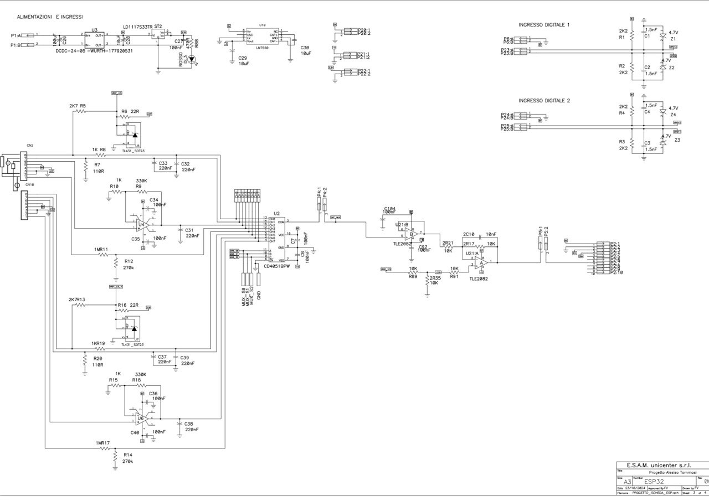
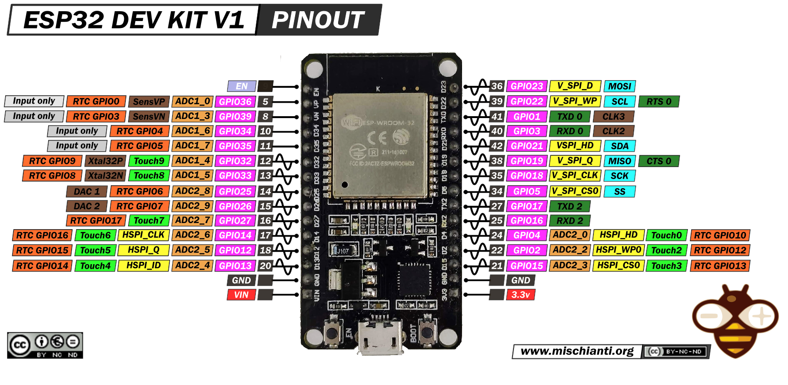

# iotProject
Progetto IoT sviluppato durante il corso Master in Computer Science della SUPSI, focalizzato su ESP32, ESAM e protocollo Modbus.

### Dipendenze:
Se utilizzi un ambiente Windows, installa `iotProject/driver/CP210x_Universal_Windows_Driver`.

### CONFIGURAZIONE ARDUINO IDE:

Per compilare i file nelle sottocartelle, è necessario aggiungerli come librerie (file .zip) all'IDE di Arduino.
Ho creato una cartella apposita per le librerie in cui inserire/sostituire i file zip;
Per una corretta compilazione, è necessario importare tutte le cartelle zip presenti in /Library:

Dal gestore schede assicurati di avere installato la seguente versione delle schede: esp32 by Espressif Systems 3.0.7. Le versioni successive causano problemi con la libreria del webserver, vedi dettagli nella cartella `issues`!

Versione di Arduino IDE da utilizzare: 2.3.4

### Schema Elettrico:

### Diagramma UML:

## Macchina a Stati: 

## Schematizzazione Elettrica del progetto semestrale:

## Dispositivo utilizzato in fase di sviluppo:

## Pinout proposti per lo slave Modbus

File utilizzato per testare lo slave: [Qui](src/SLAVE_EXAMPLE/modbusSlave2/modbusSlave2.ino)

Secondo me non funzionante perché ho un devkit V1 e non altri tipi di ESP!

## Licenza

Questo progetto è rilasciato sotto la licenza Creative Commons Attribution-NonCommercial 4.0 International (CC BY-NC 4.0). Sei libero di usare, condividere e adattare il lavoro per scopi non commerciali, a condizione di dare il giusto credito all'autore/i originale/i e di non utilizzare il materiale per scopi commerciali.

Testo completo della licenza: [Creative Commons CC BY-NC 4.0](https://creativecommons.org/licenses/by-nc/4.0/)

