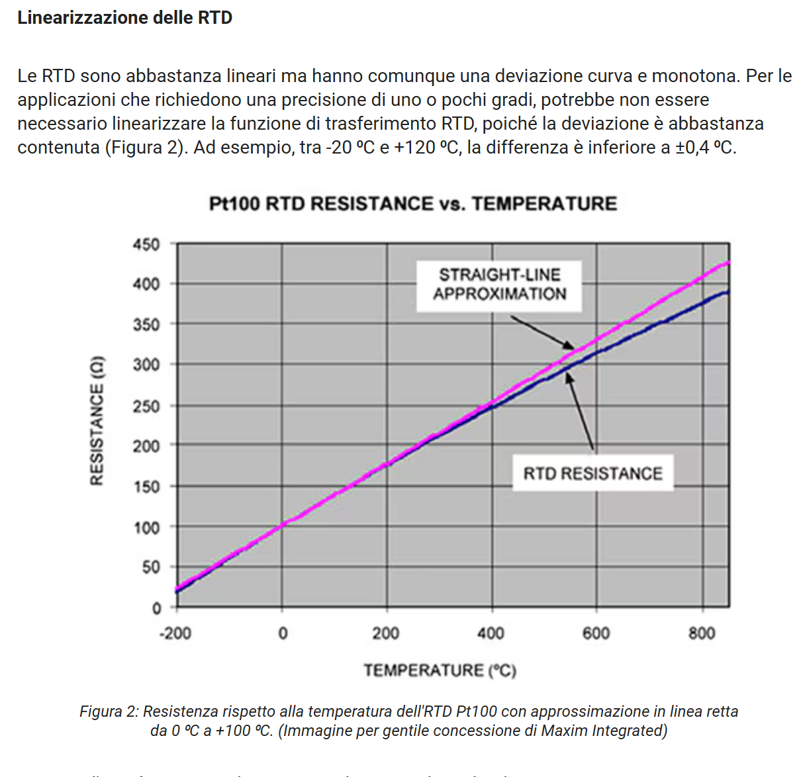
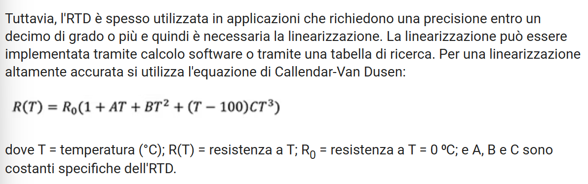

# RICHIESTA PROF: 

## linearizzazione delle sonde rtd e delle sonde termo coppie

### Guide di riferimento:
- https://www.prelectronics.com/it/assistenza/biblioteca-delle-informazioni-pr/consigli-e-trucchi/linearizzazione-delle-misure-di-temperatura/

- https://www.digikey.it/it/articles/reap-the-benefits-of-rtd-temperature-sensors?srsltid=AfmBOorcdDLs0T08IjBEiIwYOlAfgzt18wuRMfLm9GrK7-fgz_N-ISHF

Soprattutto seconda e utile!
# Domande prof:

- Davvero necessaria Linearizzazione?
    - se necessaria mi serve datasheet come quello sopra e tipo di linearizzazione che si intende effettuare

    vedi qui seconda guida:

