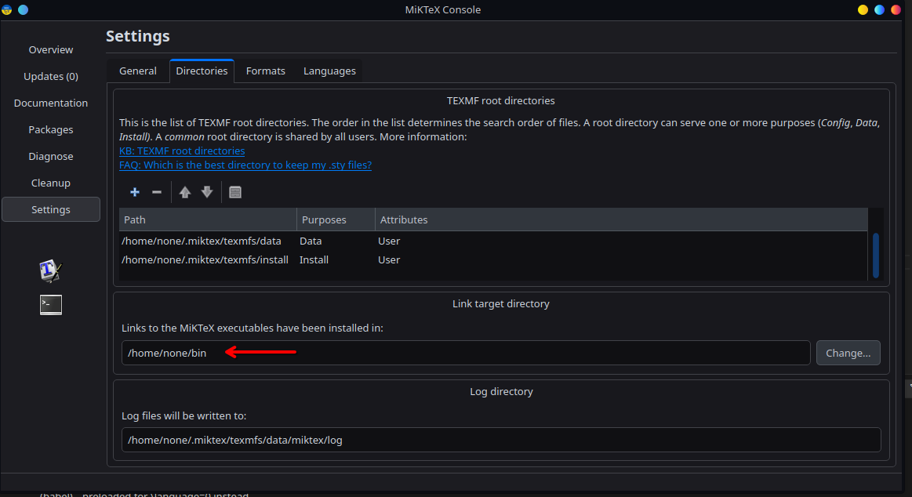

## MacOs
Latex extention: 
[Link:](https://marketplace.visualstudio.com/items?itemName=James-Yu.latex-workshop)

Latex prerequisites:
[Miktex:](https://miktex.org/download)

## Windows
Latex extention: 
[Link:](https://marketplace.visualstudio.com/items?itemName=James-Yu.latex-workshop)

Latex prerequisites:
[Miktex:](https://miktex.org/download)
[Perl:](https://strawberryperl.com/)

## Arch
Latex extention: 
[Link:](https://marketplace.visualstudio.com/items?itemName=James-Yu.latex-workshop)

Miktex: 
- yay -Ss miktex
- miktexsetup finish
- initexmf --update-fndb

Modifica il file  /home/none/.bashrc

aggiungi la riga:

```bash
export PATH="/home/none/bin:$PATH"
```

done none e' il nome utente di arch d ora in poi!

- Apri miktex console, installa latexmk

- verifica installazione del pacchetto:

```bash
    latexmk --v
```


modifica file settings.json:

si trova in questa cartella: /home/none/.config/Code/User/settings.json

 

```json

    // Configurazioni LaTeX Workshop
    "latex-workshop.latex.tools": [
        {
            "name": "latexmk",
            "command": "/home/none/bin/latexmk",
            "args": [
                "-synctex=1",
                "-interaction=nonstopmode",
                "-file-line-error",
                "-pdf",
                "%DOC%"
            ]
        }
    ],
    "latex-workshop.latex.recipes": [
        {
            "name": "latexmk",
            "tools": [
                "latexmk"
            ]
        }
    ]
```


nota: se hai problemi la cartella di installazione latexmk la trovi qui nella console miktex:




oppure compila manualmente da terminale con un terminale nella stessa cartella del file .tex:

```bash
    latexmk -pdf nomefile.tex
```bash
    latexmk -pdf documento.tex
```

se necessario esegui anche:

```bash
    source ~/.bashrc
```