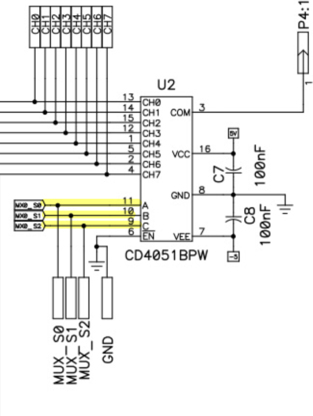
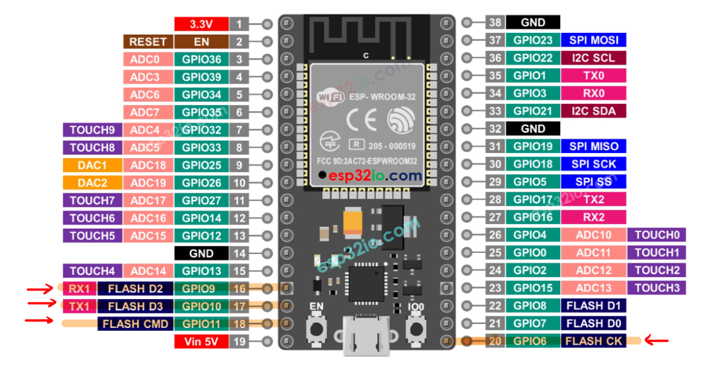

# docs of multiplexing functionality

che dovreccero corrispondere a: 

## issues: 
- prima ho provato a mappare tutti i pin ma ben presto ho raggiunto il limite di memoria mantenendo anche le funzionalita di master modbus etc quindi opto per mappare solo i pin relativi a multiplex che dovrebbero essere da diagramma esam: 11 10 9 6

## Note da confermare: 
 da quanto ho capito siccome pin 8 -7 -6 9 - 10 -11 sono utilizzati per scheda sd anche e in mutua esclusione con mutex!