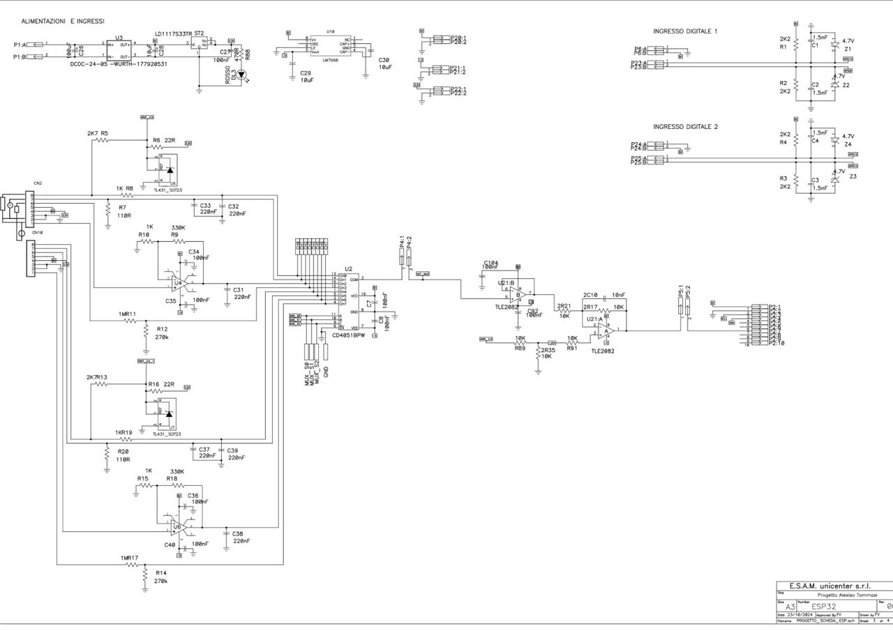
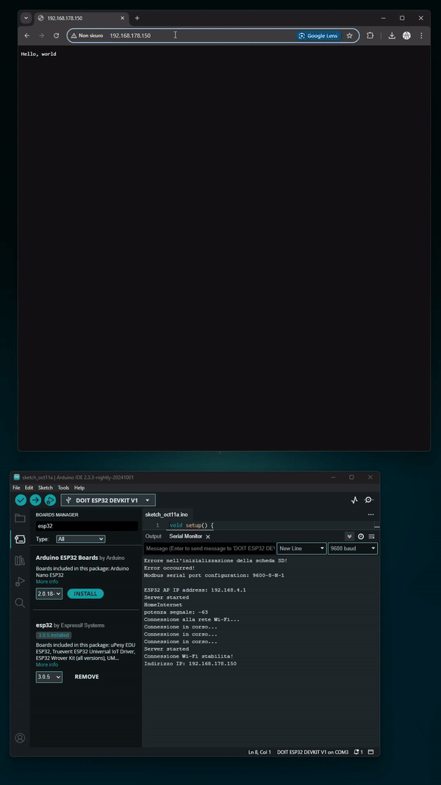
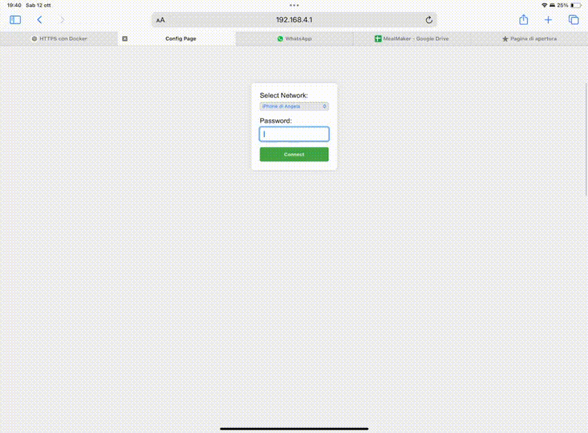
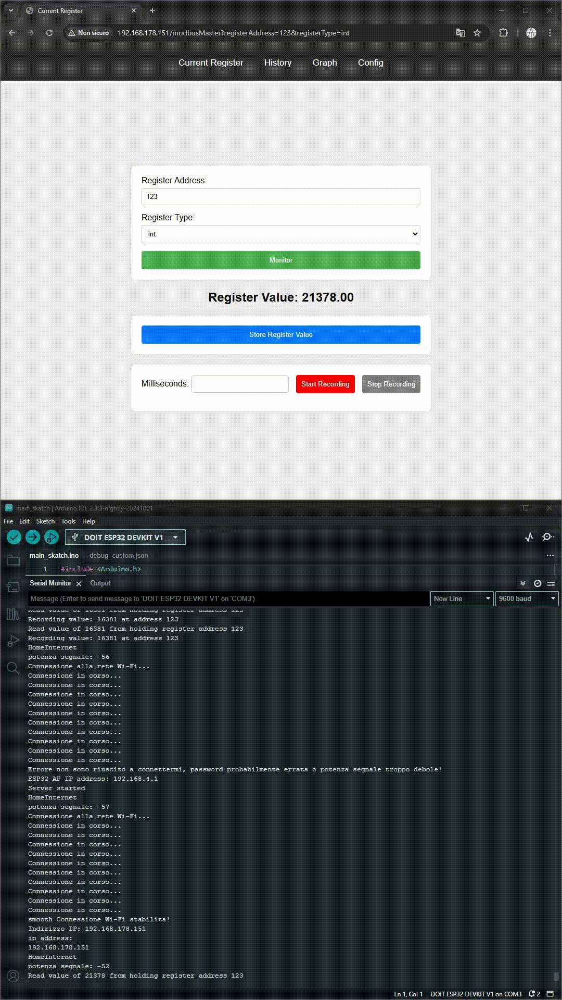

# TSM_IoT - Internet of Things 2024

| Studente        | Tutor           |
| ----------------- | ----------------- |
| Alessio Tommasi | Mirko Gelsomini |

## Anno Accademico

2024 – 2025

## Data

14-10-2024

---

# REPORT:

### Old Evaluation Criteria

| Criteria Name                              | Criteria Description                                                                                                                                                                              | tempo |
| -------------------------------------------- | --------------------------------------------------------------------------------------------------------------------------------------------------------------------------------------------------- | ------- |
| ESP32 - Modbus Master - Data Reception     | The ESP32's ability to send Modbus requests to the ESAM E2002 and accurately receive various data types converting them correctly from holding registers.                                         | .     |
| ESP32 - Modbus Master - Local Data Storage | The ESP32's capability to save different data types from holding registers into local storage efficiently.                                                                                        | .     |
| ESP32 - Modbus Slave                       | The ESP32's proficiency in responding to Modbus requests from ModScan software with accurate and reconverted data from holding registers.                                                         | .     |
| WiFi Configuration                         | The ease and success of the initial WiFi setup via a captive portal including the transition to a new network.                                                                                    | .     |
| IP Address Communication                   | Accurate communication of the new IP address to the user after connecting to the new WiFi network.                                                                                                | .     |
| Configuration Page                         | The completeness and usability of the configuration page including the ability to create, edit, and delete measurements.                                                                          | .     |
| Analytics Page                             | The accuracy and clarity of real-time data display on the analytics page in textual format.                                                                                                       | .     |
| System Stability                           | The stability and reliability of the system during normal operation including error handling and recovery processes.                                                                              | .     |
| Documentation Quality and Completeness     | The quality and thoroughness of the documentation providing step-by-step instructions, images, and relevant information for users to replicate or understand the product.                         | .     |
| Presentation Quality and Completeness      | The quality of the presentation including well-structured content, clear visuals, and comprehensive coverage of all relevant aspects of the product such as functionality and architecture.       | .     |
| Demo Quality                               | The effectiveness of the product demonstration in showcasing its features, capabilities, and value proposition, being engaging, well-prepared, and leaving a positive impression on the audience. | .     |
| User Interface Design - BONUS              | The overall design and user experience of the web interface including both the configuration and analytics pages.                                                                                 | .     |

 
 

## Attività svolte nel precedente corso:

| Criteria Name                              | Criteria Description                                                                                                                                                      | tempo |
| -------------------------------------------- | --------------------------------------------------------------------------------------------------------------------------------------------------------------------------- | ------- |
| ESP32 - Modbus Master -                    | Data Reception	The ESP32's ability to send Modbus requests to the ESAM E2002 and accurately receive various data types converting them correctly from holding registers.  | .     |
| ESP32 - Modbus Master - Local Data Storage | The ESP32's capability to save different data types from holding registers into local storage efficiently.                                                                | .     |
| WiFi Configuration                         | The ease and success of the initial WiFi setup via a captive portal including the transition to a new network.                                                            | .     |
| Configuration Page                         | The completeness and usability of the configuration page including the ability to create, edit, and delete measurements.                                                  | .     |
| System Stability                           | The stability and reliability of the system during normal operation including error handling and recovery processes.                                                      | .     |
| Documentation Quality and Completeness     | The quality and thoroughness of the documentation providing step-by-step instructions, images, and relevant information for users to replicate or understand the product. | .     |

 
 

## Nuove attivita di progetto:

# ALPHA: Acquisizione Locale di Parametri con Hardware Avanzato

## Descrizione

Il progetto consiste nella realizzazione di un sistema di acquisizione misure basato su un microcontrollore ESP32, con lo scopo di raccogliere dati da sonde di temperatura, segnali analogici e gestire uscite digitali e analogiche. Il sistema dovrà inoltre comunicare con dispositivi esterni tramite il protocollo **Modbus RTU** (RS485) e **Ethernet TCP/IP**, includendo la funzionalità di **datalogging** per la storicizzazione dei dati. Il candidato lavorerà con hardware fornito da un'azienda collaborante e utilizzerà la piattaforma di sviluppo **Arduino IDE**.

## Elettrical schematization of semester project:

## Compiti

| Attività                                 | Descrizione                                                                                                                                |
| ------------------------------------------- | -------------------------------------------------------------------------------------------------------------------------------------------- |
| **Configurazione sensori di temperatura** | Configurare e integrare sensori di temperatura**PT100**, **PT1000** e **termocoppie** utilizzando moduli come **MAX31865** e **MAX31855**. |
| **Lettura segnali analogici**             | Implementare la lettura di segnali analogici tramite gli ingressi**ADC** dell'ESP32 e eventuali moduli esterni.                            |
| **Gestione uscite digitali e analogiche** | Sviluppare la gestione delle uscite digitali e analogiche tramite l'ESP32.                                                                 |
| **Comunicazione RS485 (Modbus RTU)**      | Integrare la comunicazione**RS485** utilizzando il protocollo **Modbus RTU** per interfacciarsi con altri dispositivi.                     |
| **Server Web (Ethernet TCP/IP)**          | Sviluppare un server**Web** basato su **Ethernet TCP/IP** per il monitoraggio e controllo remoto dei dati acquisiti.                       |
| **Datalogging**                           | Implementare un sistema di**datalogging** per salvare e storicizzare i dati raccolti dai sensori.                                          |
| **Test e validazione**                    | Testare e validare il sistema attraverso simulazioni e test su hardware reale.                                                             |

## Recap Obiettivi

- Creare un sistema completo di acquisizione misure utilizzando l'ESP32.
- Garantire una corretta lettura e gestione delle sonde di temperatura (**PT100**, **PT1000**, **TC**) e segnali analogici.
- Implementare la comunicazione via **Modbus RTU** ed **Ethernet TCP/IP** con un web server integrato.
- Implementare funzionalità di **datalogging** per permettere la storicizzazione dei dati acquisiti.
- Garantire la funzionalità del sistema su hardware reale fornito dall'azienda collaborante.

## Tecnologie

- **Microcontrollore**: ESP32
- **Piattaforma di sviluppo**: Arduino IDE
- **Comunicazione**: RS485 (Modbus RTU), Ethernet TCP/IP
- **Web server**: Librerie per ESP32
- **Sensori**: Moduli MAX31865 (PT100/PT1000), MAX31855 (Termocoppie)
- **Datalogging**: Sistema di memorizzazione dati su SD card o altra memoria persistente
- **Linguaggio di programmazione**: C/C++ (Arduino)

Link alla documentazione Ufficiale: [Link](https://progettistudio.supsi.ch/dettaglio.php?p=C10936)
 
 

## Attivita che si intendono implementare prossimamente

| Criteria Name            | Criteria Description                                                                               | tempo                                  |
| -------------------------- | ---------------------------------------------------------------------------------------------------- | ---------------------------------------- |
| ESP32 - Modbus Slave | The ESP32's proficiency in responding to Modbus requests from ModScan software with accurate and reconverted data from holding registers |  |
| History Page           | The accuracy and clarity of real-time data display on the analytics page in textual format.        |                                        |
| Gant chart         | requested by Fabio on mail        |    
| doks fixed preview problem    | requested by Fabio on mail        |
| doks usage graph and history page  |      |                                                                                                                                                      

 
 

## Attivita Completate:

| Attivita                 | Descrizione                                                                                        | Tempo impiegato | Note                                                                                                                                                                                                                                                                                             |
| -------------------------- | ---------------------------------------------------------------------------------------------------- | ----------------- | -------------------------------------------------------------------------------------------------------------------------------------------------------------------------------------------------------------------------------------------------------------------------------------------------- |
| Starting Point           | Creazione Report iniziale, demo video, upload materiale e setup environment e creazione README.md | 2h 15min        |                                                                                                                                                                                                                                                                                                |
| IP Address Communication | Accurate communication of the new IP address to the user after connecting to the new WiFi network. | 4 ore           | Si è notato crash e reboot quando si immette chiave WiFi errata che causa crash e reboot!                                                                                                                                                                                                        |
| IP Address Communication | Fix 1                                                                                              | 5h              | Risoluzione errori però non posso fare sia da AP che da WiFi in 2 diverse quindi quando mi disconnetto da una rete per fare connessione a quella nuova non posso visualizzare messaggio con IP. Non si presenta problema con AP perché ESP32 può fungere sia da WiFi che da AP contemporaneamente                                                                                                                                                                                                        |
| Analytics Page           | The accuracy and clarity of real-time data display on the analytics page in textual format.        | 4.30              |                        ore impiegate: 8.30 -> 13.00   tot: 4.30 ore non funziona: lettura doppia dello stesso registro,  Lettura del valore millseconds: da testare: grafico                                                                                                                                                                                                                                                                                                        |
| Analytics Page           | The accuracy and clarity of real-time data display on the analytics page in textual format.        | 4.00              |                        ore impiegate: 19.30 -> 23.30   tot: 4.00 fix bug precedenti, creazione popup start e stop lettura. ora non funziona: lettura doppia dello stesso registro causa crash sistema,  da testare: grafico                                                                                                           
| Graph Page           |  real-time data display on the graph page         | 1h.00              |                        ore impiegate: 8.30 -> 9.30  
| Ricerca e sviluppo           |  Mobus protocol component and pinout         | 3h              |                        
|  wiznet W5500 e   ENC28J60       |  ricerca         | 4h             | 12.00 -> 16.00 of 30/10/2024
| risoluzione watchdog triggered, deadlock problem when same register multiple time, fix crash and rebbot problem|  ricerca         | 24h e 30min             | 1/11/2024 9.00 -> 12.30 AND 14.00 -> 17.00, 2/11/2024 8.00 -> 11.00 AND 14.00 -> 17.00 , 4/11/2024 8.00 -> 11.00 AND 14.00 -> 17.00, 6/11/2024 8.00 -> 14.00 |

 

---

## Demo funzionamento attuale:

 
 

 
 

Link al report pdf del report finale anno precedente: [Report](./ReportIotProject.pdf)

## Demo switch wifi:

 
 

 
 

---
 
 

## Demo AnalyticsPage:

 

   #### RICORDA: non si possono fare 2 volte rec dello stesso registro altrimenti crasha il sistema

    

 
 
 

# Ricerca e sviluppo

**NOTA: Da definire con prof se si intende utilizzare modbus TCP/IP o modbus RTU o Modbus RS-485**

## modbus TCP/IP

### Descrizione

Modbus TCP è stato sviluppato per sfruttare le infrastrutture di rete LAN esistenti, permettendo la comunicazione attraverso reti Ethernet. Attualmente viene utilizzato per qualsiasi connessione tra dispositivi connessi a internet.

Questo protocollo incapsula i messaggi Modbus RTU in pacchetti TCP, il che facilita la loro trasmissione su reti Ethernet standard. Uno dei principali vantaggi del Modbus TCP è la sua capacità di connettere un numero illimitato di dispositivi, grazie all’uso di indirizzi IP invece delle limitazioni di indirizzamento dei protocolli seriali.

In questo contesto, Modbus TCP ridefinisce la relazione master-slave in termini di client-server, permettendo una comunicazione più flessibile e scalabile. I dispositivi possono agire come client o server, facilitando l’integrazione di più sistemi e migliorando l’efficienza delle comunicazioni nelle reti industriali.

source: [Link](https://v2charge.com/it/che-cose-modbus-rtu-tpc/)

 

---
---

### Configurazione:

**2 ESP32 (oppure esp e arduino o generico microcontrollore/dispositivo sulla rete) con modbus TCP/IP (come da mail) uno che funge da server e uno da client entrambi connessi alla stessa rete.**

- **Configurazione della rete:**
   - **Connessione tramite rete WiFi:**
      - ESP32 server crea una rete WiFi.
      - ESP32 client si connette alla rete WiFi creata dal server.
   - **Connessione tramite router WiFi:**
      - Entrambi gli ESP32 si connettono alla stessa rete WiFi del router.
   - **Connessione tramite cavo Ethernet:**
      - Necessità di connettori RJ45 per entrambi gli ESP32.
          #### PINOUT:

         Per connettere l'ESP32 a un connettore RJ45, è necessario utilizzare un modulo Ethernet come l'ENC28J60 o il W5500. Di seguito è riportato il pinout per il modulo W5500:

            | ESP32 Pin | W5500 Pin |
            | --------- | --------- |
            | 3V3       | VCC       |
            | GND       | GND       |
            | 18        | SCK       |
            | 23        | MOSI      |
            | 19        | MISO      |
            | 5         | CS        |
            | 4         | RESET     |
            | 21        | INT       |

         source: [Link](https://mischianti.org/it/esp32-ethernet-w5500-con-chiamate-standard-http-e-ssl-https/)
            
         W5500: [Link](https://www.amazon.it/AZDelivery-Internet-Ethernet-Microcontrollore-Arduino/dp/B07CYVRMPL/ref=sr_1_1_sspa?__mk_it_IT=%C3%85M%C3%85%C5%BD%C3%95%C3%91&crid=3BOYSBWTA0K9C&dib=eyJ2IjoiMSJ9.-GXfxNlCRvEU_o2m-wLiXUOPWRk1tpachANFvYeW1e6RfyYC1Dico1eSWsOYPDaCjb0IdLinvMW9KG8LrJFume99_rdMwa4NkLBP5Njii-pgOC-yGXIrAR5BhyhKqkhAcyjah8HoohQYBz67BcgjNQDLTK_u5g9onVMTUsyiie6FmWoZ96_9Y2Y01yNT9zHaZRns0rV0dblvc-8lXm3ErxvdkVSJjRdvbFkSNHhQw2eBO60ePMkN-ydOFp2y8FuA7ALrObn-WfeeHg-oXCp4ZvXjqq3fchlptvnb-sraMAI.TrlEqZkj0qiwgORyUdLxobM6BRzHC0yivAEU8Or46kM&dib_tag=se&keywords=W5500&qid=1729966674&sprefix=w5500%2Caps%2C645&sr=8-1-spons&sp_csd=d2lkZ2V0TmFtZT1zcF9hdGY&th=1)
      

---

  **1 esp e un pc che simula comunicazione modbus master tcp ip tramite software modbus tcp/ip** 

   - **Steps modscan setup:**
      - Seleziona “Connection” dal menu in alto.
      - Dal menu a tendina, scegli "Connect".
      - Nella finestra di configurazione, troverai diverse opzioni di connessione. Per utilizzare Modbus TCP:
         - Seleziona "TCP/IP" come tipo di connessione.
         - Inserisci l'indirizzo IP del dispositivo Modbus TCP.
         - Inserisci la porta del dispositivo Modbus TCP. ( di default è 502)
         - imposta id del dispositivo Modbus (di solito 1, se l'ESP32 è configurato come slave con ID 1)
         - Clicca su "OK" per confermare la configurazione.

---

## Modbus RTU

### Descrizione

È uno dei protocolli più diffusi nel settore dell'automazione industriale, grazie alla sua semplicità e affidabilità. 

Modbus RTU è basato su una comunicazione seriale asincrona, che consente la trasmissione di dati su cavi RS-485, RS-232 o RS-422.

### Caratteristiche

- **Trasmissione seriale**: Utilizza linee di comunicazione seriali, come RS-232, RS-485, ecc.
- **Formato di messaggio compatto**: I messaggi sono compatti, il che consente una trasmissione più rapida ed efficiente.
- **Modalità binaria**: I dati vengono trasmessi in un formato binario, il che significa che si usano bit (0 e 1).

### Vantaggi del Modbus RTU

- Ideale per distanze brevi e medie.
- Semplice ed economico per installazioni piccole o medie.

### Limitazioni del Modbus RTU

- Limitazioni di distanza e velocità.
- Numero limitato di dispositivi che possono essere collegati sulla stessa linea di comunicazione. ovvero 32 dispositivi.

---

### Connessioni tra Dispositivi Modbus RTU
---
##### **1. ESP32 (Master) e ESP32 (Slave) con Modulo RS-485 (MAX485)**

**Collegamenti tra Master e Slave**
- **Master - MAX485**
  - DI (TX del MAX485) collegato al TX dell’ESP32.
  - RO (RX del MAX485) collegato al RX dell’ESP32.
  - DE e RE connessi insieme a un GPIO dell’ESP32 (high per trasmettere, low per ricevere).
  - A e B collegati al bus RS-485.
  - VCC e GND connessi alla stessa fonte di alimentazione.

- **Slave - MAX485**
  - DI (TX del MAX485) collegato al TX dell’ESP32 Slave.
  - RO (RX del MAX485) collegato al RX dell’ESP32 Slave.
  - DE e RE connessi insieme a un GPIO dell’ESP32 Slave.
  - A e B collegati allo stesso bus RS-485 del Master.
  - VCC e GND condivisi.

---

#### **2. PC (Master) e ESP32 (Slave) con protocollo seriale RS-485 e Modulo (MAX485)**
**Collegamenti tra Master (PC) e Slave (ESP32) con Convertitore generico convertitore da USB a RS485 e Modulo MAX485**
- **Master - Convertitore USB-RS485**
  - Collegare il convertitore USB-RS485 alla porta USB del PC.
  - A (D+) e B (D-) del convertitore collegati al bus RS-485.
  - GND del convertitore connesso a GND del sistema (opzionale, ma consigliato per stabilità).

- **Slave - ESP32 con MAX485**
  - TX dell’ESP32 connesso a DI del MAX485, RX a RO del MAX485.
  - DE e RE collegati insieme a un GPIO per direzione TX/RX.
  - A e B del MAX485 collegati al bus RS-485 (rispettivamente ai D+ e D- del convertitore USB).
  - VCC e GND condivisi.

---

#### **3. Master (PLC) e Slave (ESP32) con Modulo RS-485 (MAX485)**
**Collegamenti tra PLC e slave ESP32**
- **PLC - Uscita RS-485**
  - A (D+) del PLC collegato all’A del MAX485 dell’ESP32.
  - B (D-) del PLC collegato al B del MAX485 dell’ESP32.
  - GND comune tra PLC e ESP32 (per evitare differenze di potenziale).

- **Slave - ESP32 con MAX485**
  - TX dell’ESP32 connesso a DI del MAX485, RX a RO del MAX485.
  - DE e RE collegati a un GPIO per il controllo direzione.
  - VCC e GND condivisi.

---

#### 4. Raspberry Pi (Master) con Modulo RS-485 e ESP32 (Slave) con Modulo RS-485
**Collegamenti tra Raspberry Pi e ESP32**
- **Master - Raspberry Pi con Modulo RS-485**
  - Modulo RS-485 connesso ai GPIO di TX e RX del Raspberry Pi.
  - A (D+) e B (D-) del modulo collegati al bus RS-485.
  - VCC e GND connessi e condivisi.

- **Slave - ESP32 con MAX485**
  - TX dell’ESP32 connesso a DI del MAX485, RX a RO del MAX485.
  - DE e RE su un GPIO per controllo direzione.
  - A e B collegati al bus RS-485 del Raspberry Pi.
  - VCC e GND condivisi.

---

#### 5. Arduino (Master) con RS-485 Shield e ESP32 (Slave) con Modulo RS-485 (MAX485)
**Collegamenti tra Arduino e ESP32**
- **Master - Arduino con RS-485 Shield**
  - TX e RX dell’Arduino connessi alla shield RS-485.
  - A (D+) e B (D-) della shield collegati al bus RS-485.
  - VCC e GND connessi alla stessa alimentazione dell’ESP32.

- **Slave - ESP32 con MAX485**
  - TX dell’ESP32 connesso a DI del MAX485, RX a RO del MAX485.
  - DE e RE connessi a un GPIO per controllo direzione.
  - A e B connessi al bus RS-485 del Master.
  - VCC e GND condivisi.

---

## Note Importanti per la Comunicazione RS-485 in Modbus RTU
- **Terminazione del Bus**: Utilizzare resistenze di terminazione da 120 Ω tra A e B alle estremità del bus per ridurre riflessioni del segnale, essenziali su lunghe distanze.
- **Alimentazione**: Assicurarsi che tutti i dispositivi abbiano la stessa massa comune (GND) per evitare interferenze e oscillazioni di segnale.
- **Impostazioni GPIO**: I pin DE e RE sui moduli MAX485 devono essere gestiti correttamente, passando a HIGH per trasmettere e a LOW per ricevere.

Modulo RS-485  [Link](https://www.amazon.it/DSD-TECH-SH-U10-Convertitore-Compatibile/dp/B078X5H8H7/ref=sr_1_4_sspa?__mk_it_IT=%C3%85M%C3%85%C5%BD%C3%95%C3%91&dib=eyJ2IjoiMSJ9.xWt92YBH0ydCoxm2tC5f4TjfZI2n33PtrBfpbQeBlufEHiB1p26bNLDFrG3mCtsOOAmUxIJQ9bGDU4r5P2wdL9VU5a67t2m3ogsBj-jWcxpt2NACl69HcHucQPSOttUMkUVha3W8C6jwH6BOMyd__Tyob6BwXS-_8eETquKN1mTvH9Gfz4Qa0mht7KSho_PgJatkoT-ICLS5ayv-mWjwEZHZOWCOycFp-TBCdpFUefTE1cTm9Hhk5wreBOn3eboQNR1KsEJjPPATlqEJXR9K71kJSG7cw5q0XtOlRok2FXo.Ih3kDxObXEg6_pvKuMUalCSlOWQguL1Ljy8d1QxQm3w&dib_tag=se&keywords=Modulo+RS-485&qid=1729969943&sr=8-4-spons&sp_csd=d2lkZ2V0TmFtZT1zcF9hdGY&psc=1)

Modulo MAX485 [Link](https://www.amazon.it/ARCELI-Modulo-sviluppo-MAX485-scheda/dp/B0785B3BS8/ref=sr_1_5?__mk_it_IT=%C3%85M%C3%85%C5%BD%C3%95%C3%91&crid=38TERY0B1XCOJ&dib=eyJ2IjoiMSJ9.IIwjd-nygYEqlnH5NYTeScw-OTAWz6hklBEoTbVoclJCyFE6xdDZEE1Oc1N86lYVKZ-LEi5e6Sj-qCteIIhP5sXyh-cMpEwlB62NCvrCtslOWPWyTMnD7SBXpae6EN5HK_XxNnNR9KdvKEYMoyg2KGID5LTAeWLi69x6zUsqq7OzEx7Fhy-cXDbd8zNZKM8JhMFNT7-3o2gG-137KdGwrXprY1lbNeSmvLj-p-aTLHqHygzup84FG4RInrBq0xc4z5UOqePjJRWuODkrlqu2vUM0anVL7Lt3lV8MS5XZ7BY.0EzhIh4Nutfz0FCFlVUgCX41xYYitgOpRYHkYOFv6Gs&dib_tag=se&keywords=MAX485&qid=1729970891&sprefix=max485%2Caps%2C634&sr=8-5)

 ---

## Modbus rs485

### Descrizione
standard di comunicazione seriale che si distingue per la sua capacità di consentire lunghe distanze e più dispositivi su una sola linea di comunicazione

### Caratteristiche
- **Trasmissione seriale**: Utilizza linee di comunicazione seriale, come RS-485, RS-232, ecc.

- **Trasmissione differenziale**: Utilizza due linee di comunicazione (A e B) per trasmettere dati, riducendo interferenze e rumore.

- **Velocita regolabili:**: Velocità di trasmissione regolabile da 300 bps a 115200 bps.

- **Controllo GPIO**: I pin DE e RE sui moduli MAX485 vanno gestiti correttamente, impostandoli su HIGH per trasmettere e su LOW per ricevere.

### Connessioni tra Dispositivi

simili a Modbus RTU

## Ricerca modulo Ethernet:

link alla pagina dedi cata creata: [Link](ResearchEthModule/README.md)