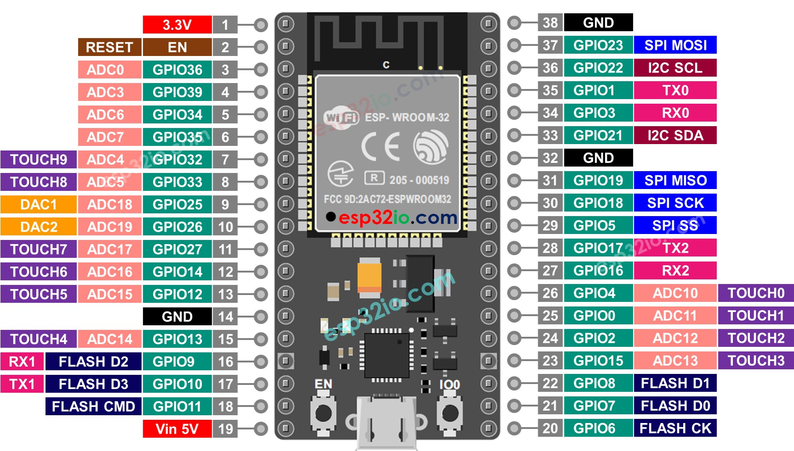
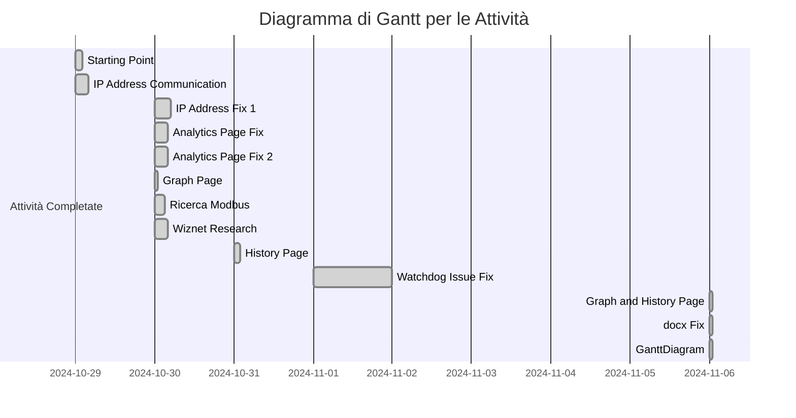

# TSM_IoT - Internet of Things 2024

| Studente        | Tutor           |
| ----------------- | ----------------- |
| Alessio Tommasi | Mirko Gelsomini |

## Anno Accademico

2024 – 2025

## Data

14-10-2024

---

# REPORT:

### Old Evaluation Criteria

| Criteria Name                              | Criteria Description                                                                                                                                                                              | tempo |
| -------------------------------------------- | --------------------------------------------------------------------------------------------------------------------------------------------------------------------------------------------------- | ------- |
| ESP32 - Modbus Master - Data Reception     | The ESP32's ability to send Modbus requests to the ESAM E2002 and accurately receive various data types converting them correctly from holding registers.                                         | .     |
| ESP32 - Modbus Master - Local Data Storage | The ESP32's capability to save different data types from holding registers into local storage efficiently.                                                                                        | .     |
| ESP32 - Modbus Slave                       | The ESP32's proficiency in responding to Modbus requests from ModScan software with accurate and reconverted data from holding registers.                                                         | .     |
| WiFi Configuration                         | The ease and success of the initial WiFi setup via a captive portal including the transition to a new network.                                                                                    | .     |
| IP Address Communication                   | Accurate communication of the new IP address to the user after connecting to the new WiFi network.                                                                                                | .     |
| Configuration Page                         | The completeness and usability of the configuration page including the ability to create, edit, and delete measurements.                                                                          | .     |
| Analytics Page                             | The accuracy and clarity of real-time data display on the analytics page in textual format.                                                                                                       | .     |
| System Stability                           | The stability and reliability of the system during normal operation including error handling and recovery processes.                                                                              | .     |
| Documentation Quality and Completeness     | The quality and thoroughness of the documentation providing step-by-step instructions, images, and relevant information for users to replicate or understand the product.                         | .     |
| Presentation Quality and Completeness      | The quality of the presentation including well-structured content, clear visuals, and comprehensive coverage of all relevant aspects of the product such as functionality and architecture.       | .     |
| Demo Quality                               | The effectiveness of the product demonstration in showcasing its features, capabilities, and value proposition, being engaging, well-prepared, and leaving a positive impression on the audience. | .     |
| User Interface Design - BONUS              | The overall design and user experience of the web interface including both the configuration and analytics pages.                                                                                 | .     |

 
 

## Attività svolte nel precedente corso:

| Criteria Name                              | Criteria Description                                                                                                                                                      | tempo |
| -------------------------------------------- | --------------------------------------------------------------------------------------------------------------------------------------------------------------------------- | ------- |
| ESP32 - Modbus Master -                    | Data Reception	The ESP32's ability to send Modbus requests to the ESAM E2002 and accurately receive various data types converting them correctly from holding registers.  | .     |
| ESP32 - Modbus Master - Local Data Storage | The ESP32's capability to save different data types from holding registers into local storage efficiently.                                                                | .     |
| WiFi Configuration                         | The ease and success of the initial WiFi setup via a captive portal including the transition to a new network.                                                            | .     |
| Configuration Page                         | The completeness and usability of the configuration page including the ability to create, edit, and delete measurements.                                                  | .     |
| System Stability                           | The stability and reliability of the system during normal operation including error handling and recovery processes.                                                      | .     |
| Documentation Quality and Completeness     | The quality and thoroughness of the documentation providing step-by-step instructions, images, and relevant information for users to replicate or understand the product. | .     |

 
 

## Nuove attivita di progetto:

# ALPHA: Acquisizione Locale di Parametri con Hardware Avanzato

## Descrizione

Il progetto consiste nella realizzazione di un sistema di acquisizione misure basato su un microcontrollore ESP32, con lo scopo di raccogliere dati da sonde di temperatura, segnali analogici e gestire uscite digitali e analogiche. Il sistema dovrà inoltre comunicare con dispositivi esterni tramite il protocollo **Modbus RTU** (RS485) e **Ethernet TCP/IP**, includendo la funzionalità di **datalogging** per la storicizzazione dei dati. Il candidato lavorerà con hardware fornito da un'azienda collaborante e utilizzerà la piattaforma di sviluppo **Arduino IDE**.

## Elettrical schematization of semester project:

## Microcontrollore utilizzato:
 
 ESP32 38 pin 

### pinout: 

# Compiti progetto semestre

| Attività                                 | Descrizione                                                                                                                                |
| ------------------------------------------- | -------------------------------------------------------------------------------------------------------------------------------------------- |
| **Configurazione sensori di temperatura** | Configurare e integrare sensori di temperatura**PT100**, **PT1000** e **termocoppie** utilizzando moduli come **MAX31865** e **MAX31855**. |
| **Lettura segnali analogici**             | Implementare la lettura di segnali analogici tramite gli ingressi**ADC** dell'ESP32 e eventuali moduli esterni.                            |
| **Gestione uscite digitali e analogiche** | Sviluppare la gestione delle uscite digitali e analogiche tramite l'ESP32.                                                                 |
| **Comunicazione RS485 (Modbus RTU)**      | Integrare la comunicazione**RS485** utilizzando il protocollo **Modbus RTU** per interfacciarsi con altri dispositivi.                     |
| **Server Web (Ethernet TCP/IP)**          | Sviluppare un server**Web** basato su **Ethernet TCP/IP** per il monitoraggio e controllo remoto dei dati acquisiti.                       |
| **Datalogging**                           | Implementare un sistema di**datalogging** per salvare e storicizzare i dati raccolti dai sensori.                                          |
| **Test e validazione**                    | Testare e validare il sistema attraverso simulazioni e test su hardware reale.                                                             |

     

---

# Compiti Tesi

| **Attività**                                  | **Descrizione**                                                                                                                                | **Note** |
|-----------------------------------------------|------------------------------------------------------------------------------------------------------------------------------------------------|----------|
| Acquisizione segnali analogici                | Acquisizione di tensione, corrente, resistenza, termocoppia e Pt100.                                                                           |    Implementato come da specifica ma da test con resistenza non passati      |
| Impostazioni utente                           | Possibilità di impostare:                                                                                                                     |    Fatto e testato  Tutta la sezione      |
|                                               | - **Ingresso in tensione:** inizio scala, fondo scala                                                                                          |          |
|                                               | - **Ingresso in corrente:** inizio scala, fondo scala                                                                                          |          |
|                                               | - **Ingresso termocoppia:** tipo di termocoppia                                                                                                |          |
|                                               | - **Ingresso RTD (es. Pt100):** tipo di termo resistenza                                                                                       |          |
| Lettura via Modbus RTU                        | Possibilità di leggere ogni grandezza utilizzando il protocollo Modbus RTU.                                                                   |     Fatto e da testare Master: mentre slave testato, non funzionante se collegato su scheda ma funzionante una volta distaccato da essa collegamenti scheda testati e risultano corretti la parte di slave potrei implementarla in /currentregister      |
| Interfaccia web e Modbus RTU slave            | Possibilità di interrogare, tramite Modbus RTU master, altri dispositivi e rileggere i parametri tramite interfaccia web e seriale Modbus RTU. |      interfaccia veb master disponibile mentre slave da implementare (attesa completo funzionamento parte precedente)    |
| Gestione uscite analogiche                    | Ogni uscita analogica può essere associata a uno degli ingressi analogici.                                                                    |    Fatto vedi pagina /multiplex graph da vedere se e corretto      |
|                                               | - Configurazione esempio: Lettura di una tensione ingresso 0-10V e associazione a un'uscita analogica 0-10V.                                   |          |
|                                               | - Prevedere opzioni configurabili dall’utente.                                                                                                |          |
| Gestione uscite digitali                      | Ogni uscita digitale può essere associata a ingressi analogici o digitali.                                                                    |    Fatto vedi pagina /multiplex graph da vedere se e corretto      |
|                                               | - **Ingresso digitale:** Se attivo, attiva l'uscita.                                                                                          |          |
|                                               | - **Ingresso analogico:** Configurazione soglie di allarme (minima o massima).                                                                |    TODO      |
|                                               | - Esempio: Soglia massima 10mA per ingresso 0-20mA, se superata, l’uscita corrispondente si attiva.                                           |     TODO     |
| Documentazione software                       | Creazione di un documento di sintesi con spiegazione dettagliata e codice commentato.                                                         |     Done da chiedere se per tesi si necessita ppt e durata presentazione     |
| Verifica funzionalità                         | Step di verifica con spiegazione dettagliata del software prima della sessione d’esame.                                                      |          |
| Plus: Ethernet con Modbus TCP/IP              | Implementazione del protocollo Ethernet Modbus TCP/IP.                                                                                        |          |

## Recap Obiettivi

- Creare un sistema completo di acquisizione misure utilizzando l'ESP32.
- Garantire una corretta lettura e gestione delle sonde di temperatura (**PT100**, **PT1000**, **TC**) e segnali analogici.
- Implementare la comunicazione via **Modbus RTU** ed **Ethernet TCP/IP** con un web server integrato.
- Implementare funzionalità di **datalogging** per permettere la storicizzazione dei dati acquisiti.
- Garantire la funzionalità del sistema su hardware reale fornito dall'azienda collaborante.

## Tecnologie

- **Microcontrollore**: ESP32
- **Piattaforma di sviluppo**: Arduino IDE
- **Comunicazione**: RS485 (Modbus RTU), Ethernet TCP/IP
- **Web server**: Librerie per ESP32
- **Sensori**: Moduli MAX31865 (PT100/PT1000), MAX31855 (Termocoppie)
- **Datalogging**: Sistema di memorizzazione dati su SD card o altra memoria persistente
- **Linguaggio di programmazione**: C/C++ (Arduino)

Link alla documentazione Ufficiale: [Link](https://progettistudio.supsi.ch/dettaglio.php?p=C10936)
 
 

## Attivita che si intendono implementare prossimamente

| Criteria Name            | Criteria Description                                                                               | tempo                                  |
| -------------------------- | ---------------------------------------------------------------------------------------------------- | ---------------------------------------- |
| ESP32 - Modbus Slave | The ESP32's proficiency in responding to Modbus requests from ModScan software with accurate and reconverted data from holding registers |  |
| Gant chart         | requested by Fabio on mail        |    
|  Modulo ENC28J60      | test if work with modbusrtu and modscan        |
|  Modulo ENC28J60      | adapter for esp32        |      
|  Multiplex      | creazione pagina web che stampa dedicata: tutti i valori letti in input sul pin gpio, e possibilita di registrarli e plotgtarli in un grafico come accade per modbus registry         |                                                                                                                                                        

 
 

## Attivita Completate:

| Attivita                 | Descrizione                                                                                        | Tempo impiegato | Note                                                                                                                                                                                                                                                                                             |
| -------------------------- | ---------------------------------------------------------------------------------------------------- | ----------------- | -------------------------------------------------------------------------------------------------------------------------------------------------------------------------------------------------------------------------------------------------------------------------------------------------- |
| Starting Point           | Creazione Report iniziale, demo video, upload materiale e setup environment e creazione README.md | 2h 15min        |                                                                                                                                                                                                                                                                                                |
| IP Address Communication | Accurate communication of the new IP address to the user after connecting to the new WiFi network. | 4 ore           | Si è notato crash e reboot quando si immette chiave WiFi errata che causa crash e reboot!                                                                                                                                                                                                        |
| IP Address Communication | Fix 1                                                                                              | 5h              | Risoluzione errori però non posso fare sia da AP che da WiFi in 2 diverse quindi quando mi disconnetto da una rete per fare connessione a quella nuova non posso visualizzare messaggio con IP. Non si presenta problema con AP perché ESP32 può fungere sia da WiFi che da AP contemporaneamente                                                                                                                                                                                                        |
| Analytics Page           | The accuracy and clarity of real-time data display on the analytics page in textual format.        | 4.30              |                        ore impiegate: 8.30 -> 13.00   tot: 4.30 ore non funziona: lettura doppia dello stesso registro,  Lettura del valore millseconds: da testare: grafico                                                                                                                                                                                                                                                                                                        |
| Analytics Page           | The accuracy and clarity of real-time data display on the analytics page in textual format.        | 4.00              |                        ore impiegate: 19.30 -> 23.30   tot: 4.00 fix bug precedenti, creazione popup start e stop lettura. ora non funziona: lettura doppia dello stesso registro causa crash sistema,  da testare: grafico                                                                                                           
| Graph Page           |  real-time data display on the graph page         | 1h.00              |                        ore impiegate: 8.30 -> 9.30  
| Ricerca e sviluppo           |  Mobus protocol component and pinout         | 3h              |                        
|  wiznet W5500 e   ENC28J60       |  ricerca         | 4h             | 12.00 -> 16.00 of 30/10/2024
| History Page           | The accuracy and clarity of real-time data display on the analytics page in textual format.        | 2h |  9.30 -> 11.30 of 31/10/2024
| risoluzione watchdog triggered, deadlock problem when same register multiple time, fix crash and rebbot problem|  ricerca         | 24h e 30min             | 1/11/2024 9.00 -> 12.30 AND 14.00 -> 17.00, 2/11/2024 8.00 -> 11.00 AND 14.00 -> 17.00 , 4/11/2024 8.00 -> 11.00 AND 14.00 -> 17.00, 6/11/2024 8.00 -> 14.00 |
| doks usage graph and history page + test |  see the video in the follwing section    |   1h  | 14.00 -> 15.00 of 6/11/2024 
| doks fixed preview problem    | see [Here](./issues/README.md) error detail       |  1h  | 15.00 -> 16.00 of 6/11/2024    
| gant diagram   | in this file at section Diagramma di Gantt per le Attività       |  1h  | 16.00->17 of 6/11/2024   
|  Modulo ENC28J60    | research initial + test with arduino nano       |  3h  | 15.00->18 of 13/11/2024  
|  Fix driver issues Adattatore convertitore da USB a RS485 per w11   |see [Here](./issues/Adattatore%20convertitoreUSBaRS485.md) the detail of this error and the research done       |  11h  |   15.00->18.00 of 19/11/2024   9.00->11.00; 14.00->18.00 of 20/11/2024   9.30->12.30 of 21/11/2024 
|  Modbus Slave test and work   | not working yet       |  7h  |   9.00->12.00 AND   13.30->17.30;  of 06/12/2024   
|  Multiplex   | not working yet       |  10  |   8.00->12.00 AND   13.00->19.00;  of 21/12/2024   
|  Multiplex   | ho trovato errore: limite  memoria ESP vedi    [link](https://github.com/AlessioTommasi-supsi/ArduinoLibrary/blob/progettosemestreOttimizzaz/model/Esp32_38pin.cpp) se aggiungo qualcosa altro dopo il commento ESP crasha per limite memoria superato!     |  7.30  |   7.30->11.00 AND   14.00->18.00;  of 21/12/2024 POSSIBILI SOLUZIONI passare al chip ESP32-S3 che ha il doppio della memoria integrata pero si devono adattare i pin
|  Multiplex   | fix parziale memoria da mac riesco a fare 2 pin + multithead start and stop + grafico con i valori di tensione letti [video demo](./video/MULTIPLEX.mov)   NOTA:   da testare se magari e perche non uso memoria dinamica e quindi statica preallocata va fuori range massimo  per far cio successivamente prevedo di implementare pagina con circular progress bar per vedere la memoria utilizzata e libera   |  23h = 7+8+8  |   9.00->11.00 AND   14.00->19.00;  of 22/12/2024   9.00->11.00 AND   13.00->19.00;  of 23/12/2024   9.00->11.00 AND   14.00->19.00;  of 24/12/2024  
|  Monitor    | implementazione pagina per monitoraggio di risorse      |  3.15 + 3.30 + 5.30 = 12.15h  |   8.00->11.15 AND   13.30->17.00;  of 26/12/2024      13.30->19.00  of 27/12/2024  
|  Multiplex    | ho provato a implementare utilizzando heap ma da ancora sesso problema, crash dopo aggiunta di 2 pin!  inoltre heap risulta utilizzato solo al 50%!!    | 6h |   13.00->19.00 AND   13.30->17.00;  of 26/12/2024   
|  Multiplex    | risolto errore con static e gestendo add pin in initializepin    | 6.30h |   9.00->11.00 AND   13.30->17.00;  of 28/12/2024   
|  Multiplex    | risolto errore initializepin  con certi pin da errore perche provo a leggere da risorse che sono utilizzatte per wifi!   | 6.30h |   9.00->11.00 AND   13.30->17.00;  of 29/12/2024   
|  Multiplex    | DEBUG errore ADC3 - SENSOGuru Meditation Error: Core  1 panic'ed   accade quando compilo ma ho aperto http://192.168.178.144/pinout  perche prova a leggere quando in effetti non ho ancora finito di costruire oggetto!   | 2h |   9.00->11.00  of 28/12/2024  ANCORA DA APPROFONDIRE BENE COME GESTIRE pero siccome e errore che puo accadere solo in fase di boot non e approfondito per ora  
|  Monitor    | GRAFICO stack per ogni singolo thread di registrazione nella pagina monitor!     |  3.15 + 3.30 + 5.30 = 12.15h  |   8.00->11.15 AND   13.30->17.00;  of 26/12/2024      13.30->19.00  of 30/12/2024  
|  docs tesi    | creazione documento tesi.tex     |  24h  |      8.00->11.30 AND   13.30->17.300;  of 14/02/2025      8.00->11.30 AND   13.30->17.300;  of 15/02/2025      8.00->11.30 AND   13.30->17.300;  of 16/02/2025     8.00->11.30 AND   13.30->17.300;  of 17/02/2025     
|  docs tesi    | correzione con le modifiche sugerite da Fabio    |  12h  |   13.30->17.30;  of 18/02/2025      8.00->11.30 AND   13.30->17.300;  of 19/02/2025  
|  docs tesi    | correzione con le modifiche sugerite da Mirco [link](./Mail_Correzioni_Mirko.pdf) ancora da completare    |  2h  |   8.30->10.30;  of 24/02/2025      
|  bugFix presentazione    | debug degli errori che si sono verificati durante la presentazione e fix della maggior parte di essi    |  8h  |   8.30->10.30; AND   13.30->17.30;  of 25/02/2025      
|  Edit Pin    | creazione     |  12  |   8.30->11.30; AND   13.30->17.30;  of 26/02/2025        10.30->11.30; AND   13.30->16.30;  of 27/02/2025     
|  Edit Pin    | testing -sono statirilevati bug dovuti ad accesso concorrente delle risorse quando piu pagine attive su /pinout    |  2h  |   8.30->10.30;  of 28/02/2025      
|  Edit Pin    | correzione bug accesso concorrente: non acora del tutto fixato ma si pensa di risolvere mettendo mutex in SystemState     |  16h  |    13.30->17.30;  of 28/02/2025        8.30->11.30; AND   13.30->16.30;  of 01/03/2025      8.30->11.30; of 02/03/2025     
|  ADS1115    | creazione sketch ../src/ADS1115     |  6h 30min |  8.30->11.30; AND   13.30->18.30;  of 14/03/2025   
|  Modbus master view    | fix errore concorrenza che causava crash dispositivo quando piu client connessi     |  8h |  8.30->11.30; AND   13.30->18.30;  of 21/03/2025 
|  Multiser functionality    | organizzazione delle routes tramite pattern decorator per aggiunta e rimozione a run time in base del tipo di utente connesso ancora da comletare tutta la parte relativa alla greazione e gestione dell utente    |  8h |  8.30->11.30; AND   13.30->18.30;  of 21/03/2025 
|  Impostazioni utente    | creazione form per mettere tipo di entrate e uscite da parte dell utente, come richiesto da prof, per ora solo creato html necessito di implementarlo nel progetto    |  8h |  8.30->11.30; AND   13.30->18.30;  of 22/03/2025 
|  Ottimizzazione    | modifica del partizionamento dell esp per dar piu spazio all applicazione, rimozione della funzionalita OTA ora si ha a disposizione 3M per applicativo al posto di 1    |  8h |  8.30->11.30; AND   13.30->18.30;  of 23/03/2025 
|  Ricerca    | linearizzazione delle sonde rtd e delle sonde termo coppie  maggiori info [Qui!](./LINEARIZZAZIONE_SONDE.md)    |  8h |  8.30->11.30; AND   13.30->18.30;  of 24/03/2025 
|  fix errore compatibilita board     |   maggiori info [Qui!](./issues/arduino_espaasynkwebsrv_error.md  )    |  8h |  8.30->11.30; AND   13.30->18.30;  of 25/03/2025 

  
  
  

    section Attività Future
    ESP32 - Modbus Slave      :active, f1, 07/11/2024, 2d
    Gantt Chart               :active, f2, 09/11/2024, 1d