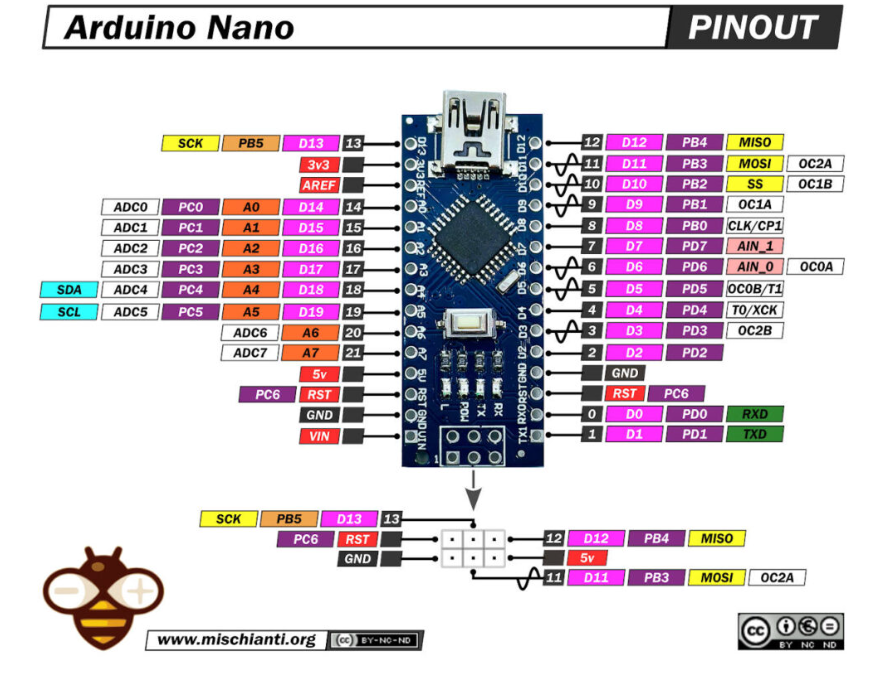
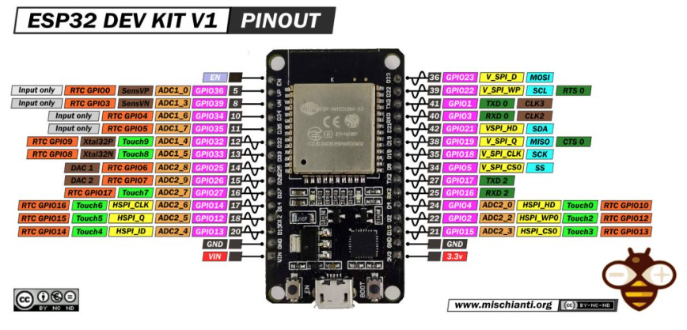
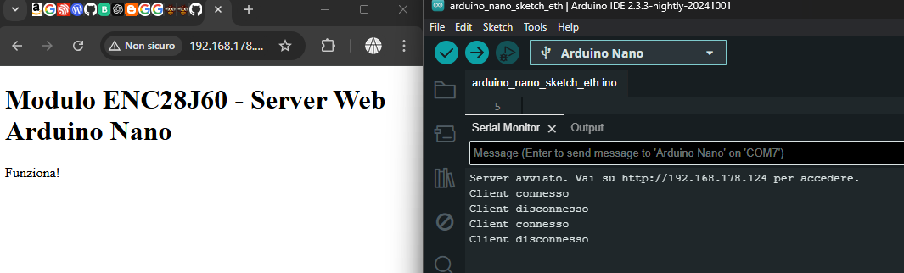
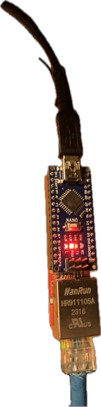

# Risultati Ricerca Ethernet su ESP32: Moduli W5500 e ENC28J60

Questo documento e riassunto delle conclusioni sulla ricerca di quale modulo Ethernet è più adatto per l'implementazione su ESP32.

## Confronto tra Moduli W5500 e ENC28J60

### Modulo W5500

#### Vantaggi
- **Alta velocità e prestazioni**: Supporta fino a 80 Mbps grazie al buffer hardware dedicato.
- **Stack TCP/IP hardware integrato**: Libera risorse sul microcontrollore ESP32.
- **Consumo energetico ridotto**: Più efficiente rispetto all’ENC28J60, ideale per applicazioni a basso consumo.
- **Compatibilità ampia**: Supportato dalla libreria **Ethernet** ufficiale di Arduino.

#### Svantaggi
- **Costo leggermente superiore**: Di solito è più costoso rispetto all’ENC28J60. comunque pochi euro da differenza. vedi link allegato nella sezione ricerca completa. sia di W5500 che di ENC28J60.

#### Casi d’uso
- **Applicazioni ad alta velocità**: Perfetto per trasferimento dati ad alta velocità o applicazioni industriali.
- **Applicazioni critiche**: Ideale per progetti in cui stabilità e affidabilità sono prioritarie.
- **Applicazioni a basso consumo**: Adatto per dispositivi alimentati a batteria o con vincoli energetici.

[Ricerca completa](W5500Example/README.md)

### Modulo ENC28J60

#### Vantaggi
- **Costo inferiore**: Di solito è più economico rispetto al W5500.
- **Flessibilità**: ottimo per progetti di piccole dimensioni o prototipi dove il carico di lavoro è limitato.

#### Svantaggi
- **Prestazioni inferiori**: Velocità di trasferimento dati più lenta rispetto al W5500.
- **Stack TCP/IP software**: Richiede più risorse sul microcontrollore ESP32.

#### Casi d’uso
- **Progetti a basso budget**: Ottimo per progetti con budget limitato.
- **Progetti di piccole dimensioni**: Adatto per progetti semplici o prototipi.

[Ricerca completa](ENC28J60Example/README.md)

## Conclusione

Il modulo W5500 è la scelta migliore per applicazioni che richiedono prestazioni elevate, stabilità e basso consumo energetico. D'altra parte, l'ENC28J60 è più adatto per progetti a basso budget o di piccole dimensioni.

## Alti Moduli Ethernet degni di nota:

### LAN8720
 progettato per lavorare con microcontrollori e si integra bene con l'ESP32 poiché esistono versioni dell'ESP32 (ad esempio, ESP32-Ethernet-Kit) che includono direttamente il supporto per questo modulo

#### Vantaggi
- **compatibilità**: con ESP32  Supporto nativo nei framework ESP-IDF (Vs code) e Arduino IDE, con facilità di integrazione.

- **Efficenza**: Consumo energetico ridotto rispetto all'ENC28J60, ideale per applicazioni a basso consumo.

#### Svantaggi
- **Costo**: leggermente superiore rispetto all'ENC28J60, ma inferiore al W5500.

- **scarsa Reperibilita'**: non sempre facile da trovare, ma è possibile acquistarlo online.

- **Richiede una connessione fisica ben fatta**: cablaggio elettrico e connessione fisica ben fatta per evitare problemi di connessione.

### Riferimenti:
- [Github repo 1](https://github.com/ZioTester/ESP32-DevKitC-LAN8720)

- [Github repo 2 (Wiring explaination)](https://github.com/flusflas/esp32-ethernet)

- [link amazon](https://www.amazon.it/ESP32-DevKitC-LAN8720-Terminal-Sviluppo-Ethernet-LAN8720/dp/B0CKJ7XVTB/ref=sr_1_5?__mk_it_IT=%C3%85M%C3%85%C5%BD%C3%95%C3%91&crid=RV4KR2PNQI19&dib=eyJ2IjoiMSJ9.feOTzET2s7jNBnRPauYCYeznY5AY03DZJFxADOgEPAoJET0iQIaBJbNPT0UU2PA7tUDI1xXmEYhJtevVqFSjaVdVt9OYD-bcZmjr1yiFcw2ncy265Tn2zm0KcY0RQvAtDIXZgDA14Kcoh_0JgQh5ghF7vU0web2YJWdLgL3L2AQjAqrVRSublvRp4iYvTtBun6XaK2Pz_ZeFrP5OJcGGZi1NiV3sdizHO14b47mjaAp3DVsQlmnvjs5X6LvYAksCTmD8bjI6yfQSZ2jvIAt16fyo88jYbLtDYcaa6-qg-pQ.J6VqYsrHPKdDobRc2RLmHcd4yzGMS9Pti3q7qGud8tQ&dib_tag=se&keywords=ethernet+kit+esp32&qid=1730299847&sprefix=ethernet+kit+esp32%2Caps%2C137&sr=8-5)

### RTL8201 e IP101G
 sono opzioni valide per progetti industriali, specialmente per ambienti con requisiti di durata e affidabilità ma con scarsa documentazione in caso si decide di utilizzare questi moduli e necessario fare una ricerca piu approfondita su di essi.

    

# Modulo fornito:
 
 
 tale modulo sembra essere il seguente:
 https://www.amazon.it/ARCELI-ENC28J60-Ethernet-Shield-Arduino/dp/B07JL333FD/ref=sr_1_6?__mk_it_IT=%C3%85M%C3%85%C5%BD%C3%95%C3%91&crid=5BLZDWVLMKBC&dib=eyJ2IjoiMSJ9.vQdgSXCCHNioofOgClbgQk4vGgn5_d4BuNbfN56eBcRTLzkZZKe7jy-uDl_uQgFyy378WFZeUI8bJaSYHENsQ4cgJa56I5GbBLqrLcZsZDKFg_7g4rX_Qwu9BLEreYfqVLqk9JboMxVrs-4BJ7Xq2NkU_zIoWUIbk7Ceon5jw443hr1sALWVHU7bZf4RfZGXWS5G9zrlD7d8Hrb2jHjW1IqbVKWdoo8SD892gBzD-H8JelmVwrRfcx2S61YKGJMrZcBSl2nJOlHJ3EReLmT-SglSNpw1pAe9rO2FGWwqAuc._qN8FFmN65TIWU8oznYZZ4MzZIqJsteX0i63IHF_5K4&dib_tag=se&keywords=ENC28J60&nsdOptOutParam=true&qid=1731512289&sprefix=enc28j60%2Caps%2C170&sr=8-6

--- 
 da quanto emerso dalle ricerche effettuate, il modulo sembra essere un
 Ethernet Shield progettato per l’Arduino NANO o per altre schede compatibili, il che spiega perché i pin riportati corrispondano alla numerazione dei pin di Arduino e non dell'ESP32 

 --- 
 da verificare se succede il problema qui descritto: 

 ---

 basandoci su arduino nano pinout: 
 
 

    infatti se si confrontano sono esattamente uguali la nomenclatura dei pin!!

 potremmo creare dei collegamenti per esp: 
 
 

 facendo un adattatore:  pero con riserva di dubbio sul funzionamento!

 possibili collegamenti: 
| Pin del Modulo ENC28J60 | Collegamento ESP32 | Funzione                        |
|-------------------------|--------------------|---------------------------------|
| VIN                     | 3.3V o 5V          | Alimentazione (in base al modulo)|
| GND                     | GND                | Massa                           |
| D13                     | GPIO 18            | SPI Clock (SCK)                 |
| D12                     | GPIO 19            | SPI MISO (Master In, Slave Out) |
| D11                     | GPIO 23            | SPI MOSI (Master Out, Slave In) |
| D10                     | GPIO 5             | Chip Select (CS)                |
| RST                     | RST o GPIO 17 (opzionale) | Reset                    |

 per ora ho fatto test di tale modulo con arduino nano:

## Risultati TEST: 
 modulo eth perfettamente funzionante:
 codice utilizzato: [file](arduino_nano_sketch_eth/arduino_nano_sketch_eth.ino)

## Collegamenti:

