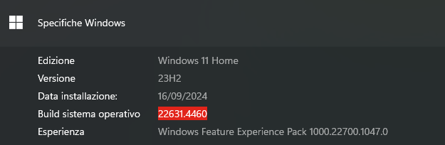

# Adattatore convertitore da USB a RS485

## Descrizione errore:

entrambi i moduli adattatori una volta collegati al pc tramite usb non vengono riconosciuti, il pc sentiva il suono di inserimento di un dispositivo usb ma 
andando in: 
 

    Gestione dispositivi -> Porte (COM e LPT) 

 
 non compariva nessun dispositivo.

 visualizzando la scheda tecnica di tale disposiivo, si e notato che il chip installato era ft232 e/o cc104 
 quindi necessitava di questo driver: [FTDI](../../driver/CDM212364_Setup.exe)

 Link alla pagina ufficiale da cui e possibile prendere documentazione e driver: [FTDI](https://ftdichip.com/drivers/)

 

## Versione di windows su quale driver e stato installato e ha risolto il problema:

## altri sistemi operativi testati su cui il problema si e presentato ma il fix non e' ancora stato testato:
- Ubuntu 20.04
- MacOS Monterey 12.0.1
- Windows 10 Education 21H1