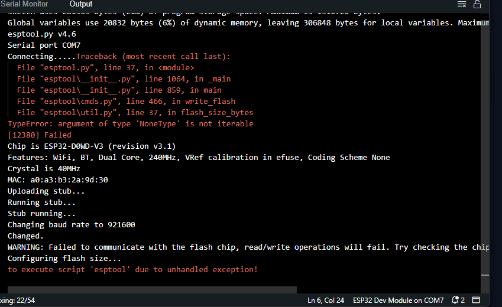
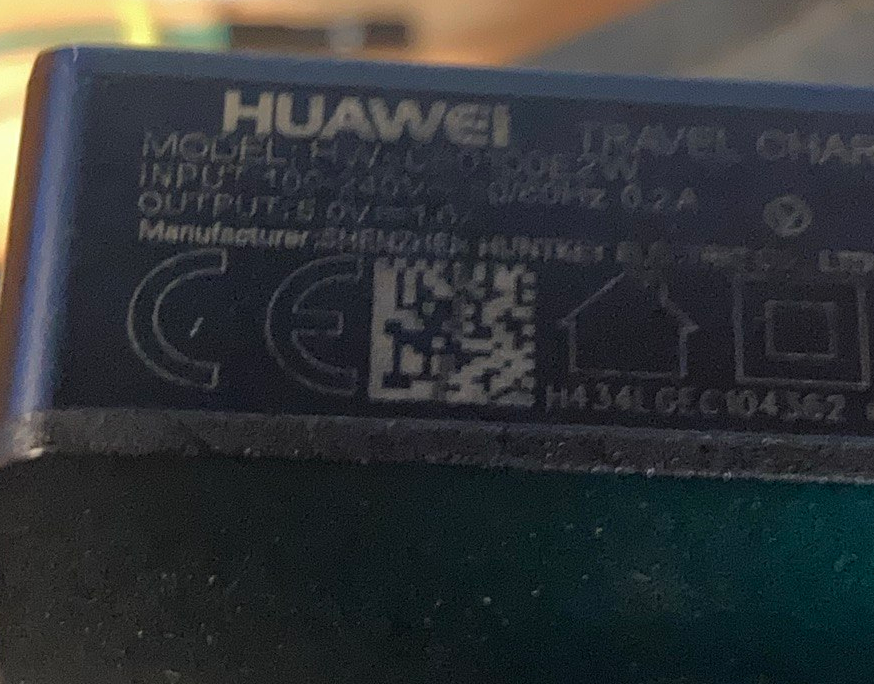
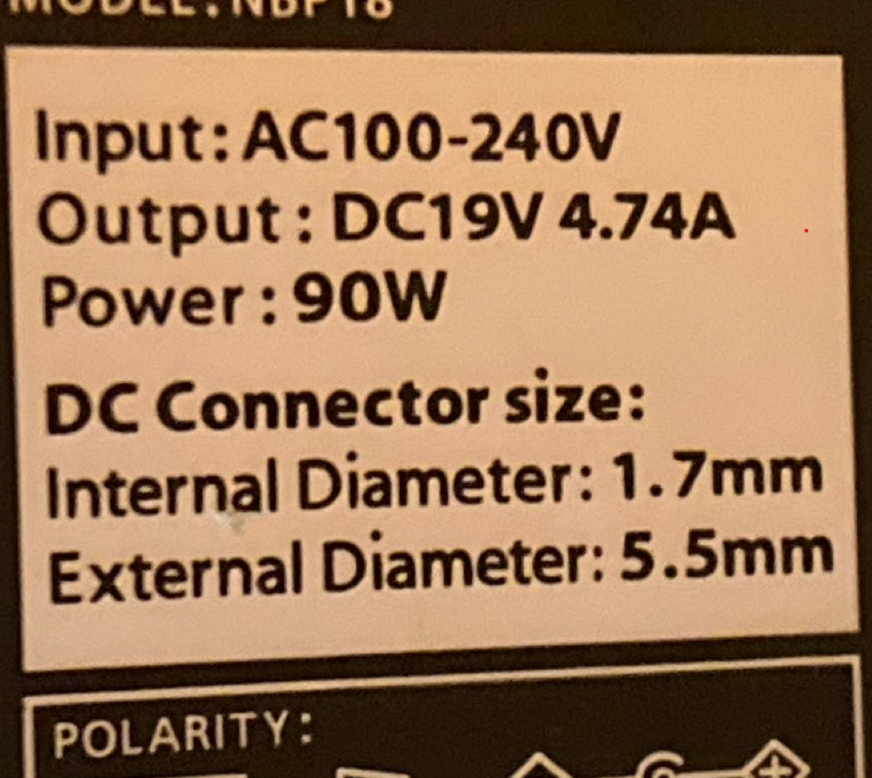
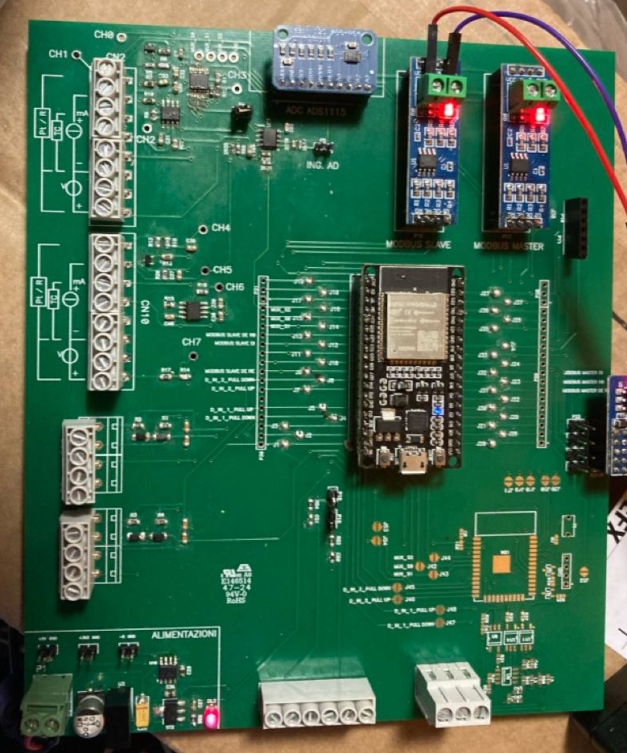
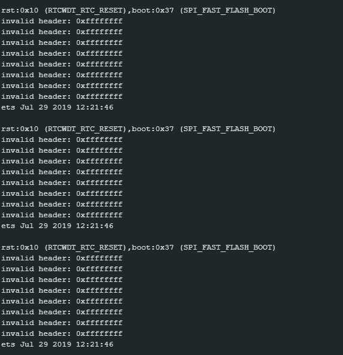
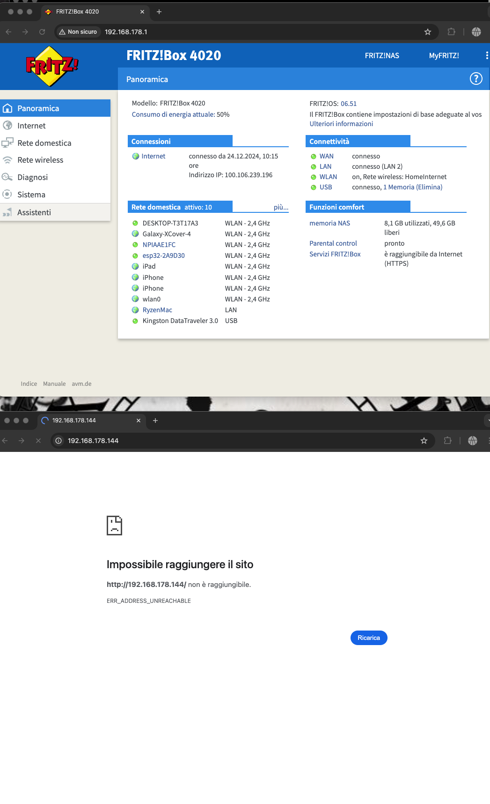

## issues related to the board

Link goodnotes: [Qui](https://web.goodnotes.com/s/MFs1q0628At8S2OhyxoSrB#page-4)

 errore: 

# Alementazione testata: 

## 5v non funzionante

alimentatore info:

NOTA il led non sia accende con solo questa alimentazione

## 19v: non funzionante

alimentatore info: 

Board state: 

Serial monitor: 

## 24v: alimentatore 19v in serie ad alimentatore 5v
nessuna differenza rispetto a 19V
devo ancora testare se 24V effettivi con multimetro

# NOTE 
se stacco Esp carico programma e poi metto ESP su board programma e caricato correttamente ma in base al codice che carico: ottengo errori modbus:

INVALID_QUERY
DEVICE NOT CONNECTED 
MODBUS TIMEOUT

# Board Voltage monitir

## NON SULLA BOARD

### da Serial Monitor:

Pin number: 32, Type: 6, Voltage: 0.000 V, Input: Yes, Note: ADC4, TOUCH9

Pin number: 33, Type: 6, Voltage: 0.000 V, Input: Yes, Note: ADC5, TOUCH8

Pin number: 19, Type: 11, Voltage: 0.000 V, Input: Yes, Note: VSPI MISO

Pin number: 25, Type: 6, Voltage: 3.300 V, Input: No, Note: ADC2 is in use by Wi-Fi. Please see https://docs.espressif.com/projects/esp-idf/en/latest/esp32/api-reference/peripherals/adc.html#adc-limitations for more info

Pin number: 18, Type: 11, Voltage: 3.300 V, Input: Yes, Note: VSPI CLK or input digital

Pin number: 26, Type: 6, Voltage: 3.300 V, Input: No, Note: ADC2 is in use by Wi-Fi. Please see https://docs.espressif.com/projects/esp-idf/en/latest/esp32/api-reference/peripherals/adc.html#adc-limitations for more info

Pin number: 5, Type: 8, Voltage: 3.300 V, Input: Yes, Note: input digital VSPI CS0, PWM

Pin number: 27, Type: 6, Voltage: 3.300 V, Input: No, Note: ADC2 is in use by Wi-Fi. Please see https://docs.espressif.com/projects/esp-idf/en/latest/esp32/api-reference/peripherals/adc.html#adc-limitations for more info

Pin number: 17, Type: 10, Voltage: 3.300 V, Input: Yes, Note: UART RXD1

Pin number: 14, Type: 6, Voltage: 3.300 V, Input: No, Note: ADC2 is in use by Wi-Fi. Please see https://docs.espressif.com/projects/esp-idf/en/latest/esp32/api-reference/peripherals/adc.html#adc-limitations for more info

Pin number: 16, Type: 10, Voltage: 3.300 V, Input: Yes, Note: UART TXD2

Pin number: 12, Type: 6, Voltage: 3.300 V, Input: No, Note: ADC2 is in use by Wi-Fi. Please see https://docs.espressif.com/projects/esp-idf/en/latest/esp32/api-reference/peripherals/adc.html#adc-limitations for more info

Pin number: 4, Type: 6, Voltage: 3.300 V, Input: Yes, Note: ADC10, TOUCH0
Pin number: 0, Type: 6, Voltage: 3.300 V, Input: No, Note: ADC2 is in use by Wi-Fi. Please see https://docs.espressif.com/projects/esp-idf/en/latest/esp32/api-reference/peripherals/adc.html#adc-limitations for more info

Pin number: 13, Type: 6, Voltage: 3.300 V, Input: No, Note: ADC2 is in use by Wi-Fi. Please see https://docs.espressif.com/projects/esp-idf/en/latest/esp32/api-reference/peripherals/adc.html#adc-limitations for more info

Pin number: 2, Type: 6, Voltage: 3.300 V, Input: No, Note: ADC2 is in use by Wi-Fi. Please see https://docs.espressif.com/projects/esp-idf/en/latest/esp32/api-reference/peripherals/adc.html#adc-limitations for more info

Pin number: 9, Type: 1, Voltage: 3.300 V, Input: Yes, Note: SD D2

Pin number: 10, Type: 1, Voltage: 3.300 V, Input: Yes, Note: SD D3

Pin number: 8, Type: 1, Voltage: 3.300 V, Input: Yes, Note: SD2 SPIWP HS1 DATA 1

Pin number: 11, Type: 1, Voltage: 3.300 V, Input: Yes, Note: SPICS0 CMD

Pin number: 7, Type: 1, Voltage: 3.300 V, Input: Yes, Note: SD0 SPIQ HS1 DATA 0

Pin number: 6, Type: 1, Voltage: 3.300 V, Input: Yes, Note: segnale di clock temporizzato

### dopo qualche secondo di lettura: da pagina web:

[PDF](Pinout_not_attached.pdf)

cime si puo notare dei pin sono differenti

## SULLA BOARD:

NOTA: con 19V risulta collegato a wifi ma non mi fa accedere da internet:
indirizzo ip e corretto!

BOARD SCOLLEGATA DA ALIMENTAZIONE ESP CONNESSO LIVE SULLA BOARD:

[text](Pinout_onBoardNoAlimentation.pdf)

BOARD CON ALIMENTAZIONE 19V da TESTER ESP CONNESSO LIVE SULLA BOARD:

[text](BoardCOnnessaALIMENTAZIONE.pdf)

## found 
on pin  13 -- tutti quelli ingressi digitali--
  trovato 5V all avvio che magari causavano crash del sistema poiche all avvie esp tenta di tirare a 0 tutti i pin ma non ce la fa

  -- guarda se posso fare fix 

  e'esattamente questo il problema. vistro che funziona mettendo in input tutti i pin