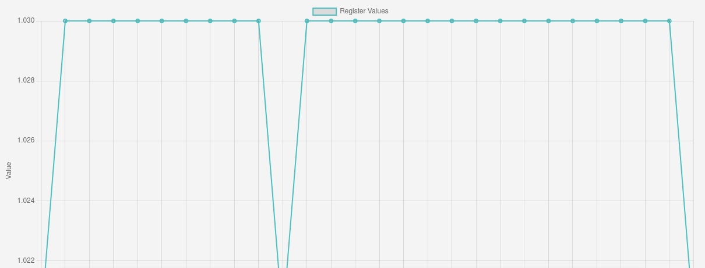
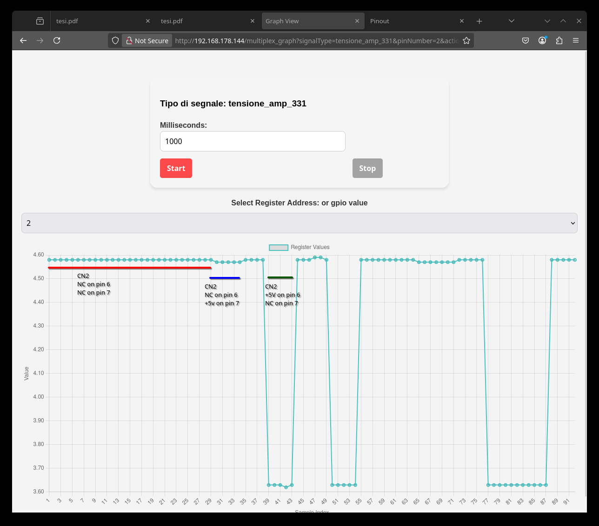
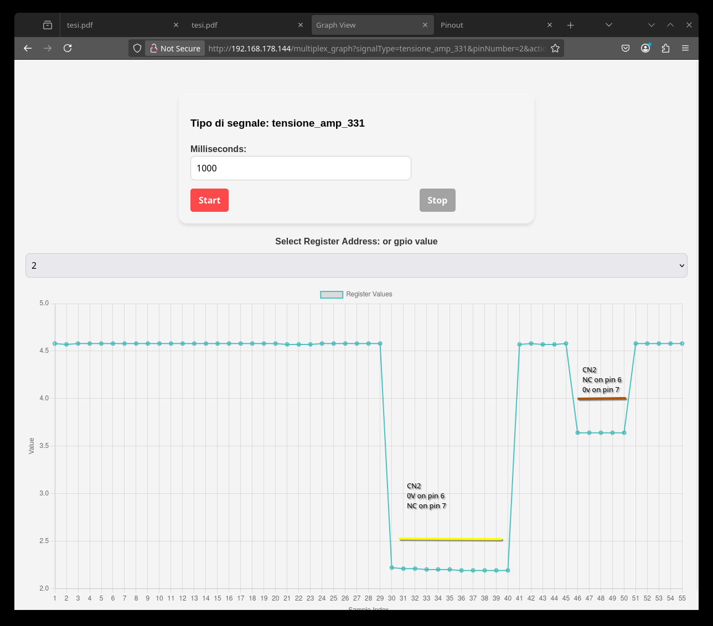

# GPIO 12 13 14 = A B C

    c0  
    Resistenza cn2 
    rilevato 0 0 1   2.5v  c3
    DOVREBBE ESSERE 0 0 0

    c1 GIUSTO!!!
    tensione non anplif cn10 
    rilevato 1 0 0    0v   c1
    DOVREBBE ESSERE 1 0 0
    SI CON START  MA DOVREBBE LEGGERE 5V E INVECE MI DA 1.03V

    c2 
    tensione CON GUADAGNO 0.3
    rilevato 1 1 0    VEDI IMG   c1
    DOVREBBE ESSERE 0 1 0

    c3 
    tensione CON GUADAGNO 0.2
    rilevato 0 1 0    VEDI IMG   c1
    DOVREBBE ESSERE 1 1 0

    Resistenza cn10 
    rilevato 0 0 1  2.5v  c3
    DOVREBBE ESSERE 0 1 1

    NOTA! SE CLICCO SU START VA GIUSTO!!! REA QUESTO L ERRORE!