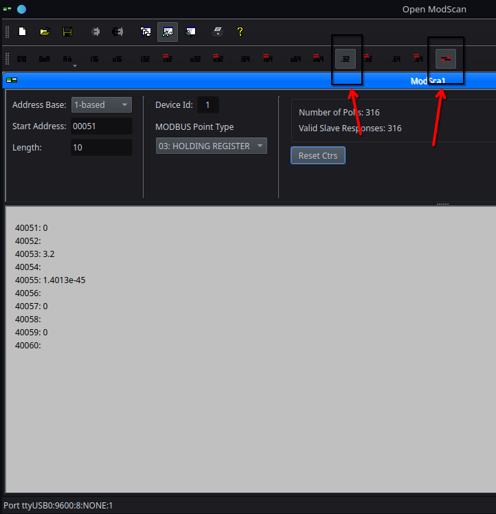

# on Arch


apri terminale: 
```bash
cd /mnt/archTb/programmi/OpenModScan-main/omodscan

```
```bash
cd ./omodscan

```

per vedere che usb: o vedi da arduino ide oppure

vai su connection e ce modbus scanner, li ti dice tutte le info!

ecco cosa ottengo una volta connesso:



ricordati da selezionare quelli indicati da freccia per far si che si veda bene!!

```bash
                ESP32
              +--------+
              |        |
    TX (GPIO22) --------> [DI] RS485 Module
              |        | 
    RX (GPIO23) <-------- [RO] RS485 Module
              |        |
   DE (GPIO18) --------> [DE] (e [RE] se collegati insieme)
              |        |
             GND ------> GND del RS485 Module
              |        |
              +--------+
                
        [RS485 Module]    --->   Bus RS485: Terminali A e B <--- (Terminazione e biasing se necessario)


```